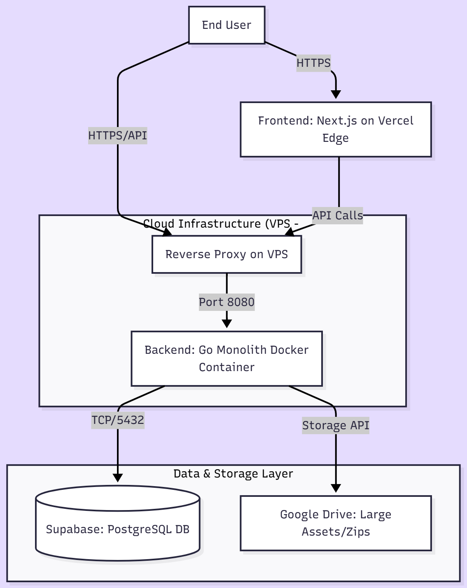
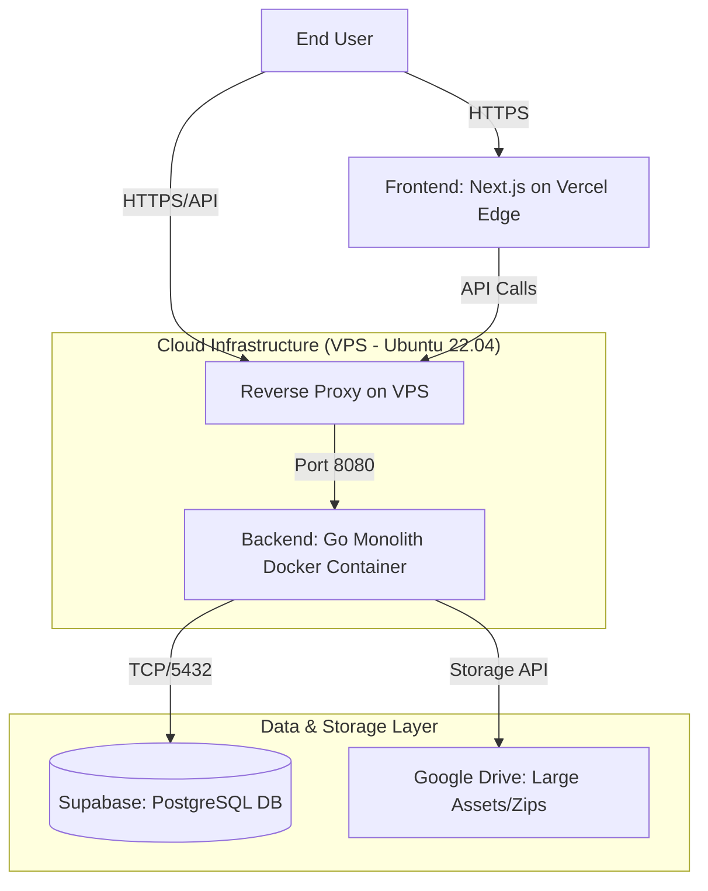
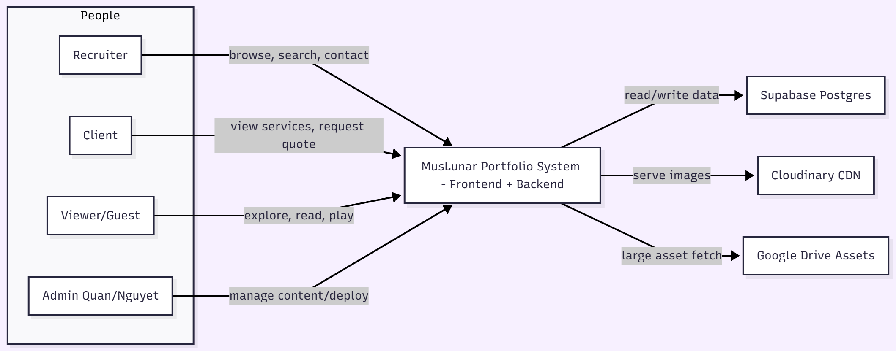
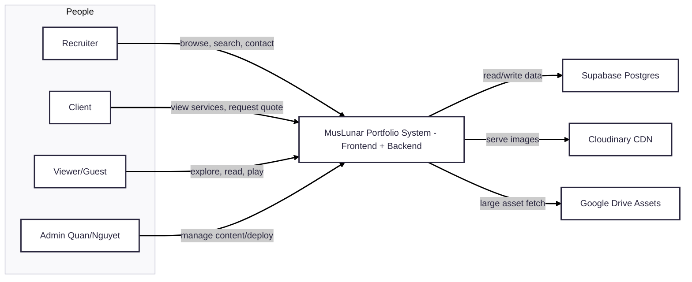
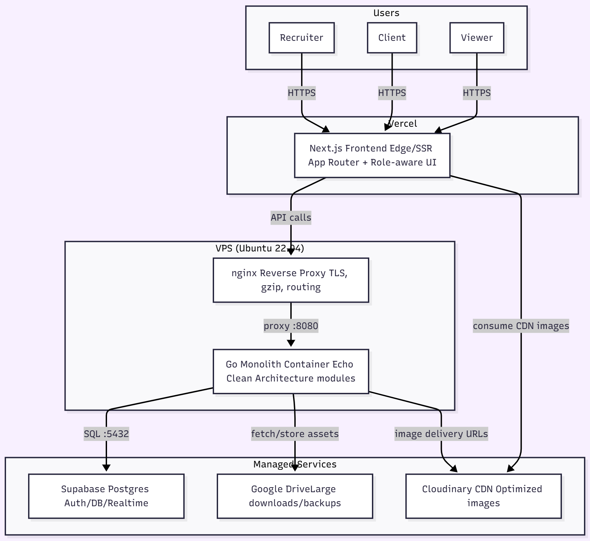
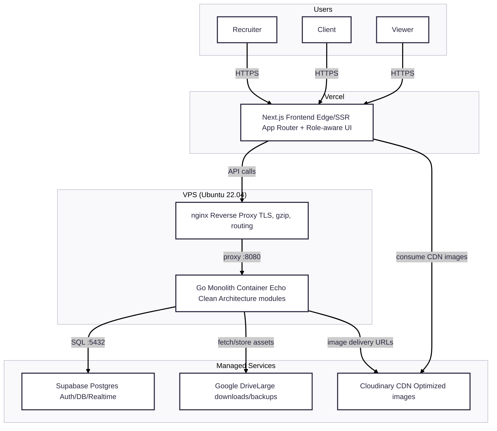

# MusLunar Portfolio - Technical Architecture Document

**Version:** 1.0  
**Date:** December 04, 2025  
**Authors:** Quan Nguyen (Dev) & Nguyet Nguyen (Des)  
**Status:** Approved for MVP Implementation

---

## 1. Executive Summary

MusLunar is a dual-protagonist portfolio platform merging high-end storytelling, e-commerce, and gamification. The system is designed to be **cost-effective** for a 2-person team (Bootstrapped), **highly performant** (Go + Next.js), and **future-proof** (Modular Architecture).

The core philosophy is **"Pragmatic Engineering"**: Using a Monolithic approach for development speed, but structured internally with Modules to allow seamless transition to Microservices if required in the future.

--- 

## 2. System Design: Hybrid Modular Monolith

We utilize a **Hybrid Deployment Strategy** to leverage the best of Serverless (Frontend) and Containerized (Backend) worlds.

### High-Level Architecture Diagram



---

## 2.1 C4 Diagrams (Level 1 and 2)

### Level 1: System Context



### Level 2: Container Diagram




Notes:
- Frontend runs on Vercel Edge; backend is a single Go container behind nginx on the VPS.
- Supabase hosts Postgres and optional auth; Cloudinary serves optimized media; Google Drive stores large digital products/backups.

---

## 3. Architectural Patterns

### 3.1 Frontend: Pragmatic Modular Monolith
**Pattern:** **Modular Architecture** combined with **Atomic Design**.
Instead of grouping by file type, we group by **Business Domain** (Modules).

*   **Structure:**
    *   `src/modules/`: Contains business logic (Showcase, Storytelling, Shop).
    *   `src/components/ui/`: Contains atomic UI elements (Shadcn UI).
    *   `src/app/`: Next.js App Router (Routing layer only).

*   **Why?**
    *   Aligns perfectly with Next.js App Router.
    *   Isolates game logic (Three.js) from E-commerce logic.
    *   Easy for the Designer to locate UI components.

### 3.2 Backend: Modular Clean Architecture
**Pattern:** **Clean Architecture** organized by **Modules**.
We enforce a strict dependency rule: *Inner layers (Entities) know nothing about outer layers (Database/HTTP).*

*   **Structure:**
    ```text
    internal/
      |- shop/                # Module Name
      |  |- delivery/         # Transport Layer (HTTP Handlers/Echo)
      |  |- usecase/          # Business Logic (Pure Go)
      |  \- repository/       # Data Access (Sqlc/Postgres)
      |- user/                # Another Module...
    ```

*   **Why?**
    *   **Decoupling:** Allows swapping Database or HTTP Framework without touching business logic.
    *   **Testability:** Business logic can be unit-tested easily by mocking repositories.
    *   **Go-Idiomatic:** Fits the standard project layout of the Go community.

---

## 4. Technology Stack

### 4.1 Frontend (The "Face")
| Category | Technology | Reasoning |
| :--- | :--- | :--- |
| **Framework** | **Next.js 15 (App Router)** | Best-in-class SEO, Hybrid Rendering (SSR/CSR), and strong ecosystem. |
| **Language** | **TypeScript** | Type safety prevents runtime errors; shares types with Backend DTOs. |
| **UI Base** | **Shadcn UI** | Provides accessible, unstyled component code (owned by us) for maximum customization. |
| **Styling** | **Tailwind CSS** | Rapid UI development, low bundle size, easy theming system. |
| **State Mngt** | **Zustand** | Lightweight (<1kB), simple API for global state (Theme, Cart, Role). |
| **Data Fetching**| **React Query** | Manages server state, caching, and background updates automatically. |
| **Animation 2D** | **Framer Motion** | Complex layout transitions and drag interactions. |
| **Animation 3D** | **React Three Fiber (R3F)** | Declarative way to use Three.js within the React component tree. |

### 4.2 Backend (The "Brain")
| Category | Technology | Reasoning |
| :--- | :--- | :--- |
| **Language** | **Go (Golang)** | High performance, low memory footprint, concurrency support for Game logic. |
| **Framework** | **Echo** | fast, minimalist web framework with great middleware support. |
| **Database Access**| **Sqlc** | Generates type-safe Go code from raw SQL. Faster and safer than GORM. |
| **Migration** | **Golang-migrate** | Robust database schema versioning. |
| **Logging** | **Zap** (Uber) | Structured, zero-allocation logging for maximum performance. |
| **Config** | **Viper** | Manages configuration from Environment variables and files. |
| **DI** | **Google Wire** | Compile-time Dependency Injection container (cleaner code). |
| **Docs** | **Swagger (Swaggo)** | Auto-generated API documentation for Frontend integration. |

### 4.3 Database & Storage
| Category | Technology | Reasoning |
| :--- | :--- | :--- |
| **RDBMS** | **PostgreSQL (via Supabase)** | Supports both Relational (Shop) and JSONB (Game) data. Free tier is generous. |
| **Large Assets** | **Google Drive (via API)** | Storing heavy digital products (ZIPs) and backups to save Supabase storage limits. |
| **UI Images** | **Cloudinary (Free Tier)** | Optimized image delivery (CDN) for product thumbnails. |

### 4.4 DevOps & Infrastructure
| Category | Technology | Reasoning |
| :--- | :--- | :--- |
| **OS** | **Ubuntu 22.04 LTS** | Industry standard, stable, vast documentation. |
| **Container** | **Docker** | Ensures environment consistency. Multi-stage builds keep images tiny (~15MB). |
| **Reverse Proxy**| **Nginx** | Handles SSL, Gzip compression, and routing to the Go container. |
| **CI/CD** | **GitHub Actions** | Automates building and deploying code to VPS on push. |

---
Here is the additional section for your **Architecture Design Document**. You can append this to the end of the file or insert it as **Section 5** (renaming the current Section 5 to Section 6).

This section specifically addresses the **"Provider Selection Strategy"**?explaining the *Who*, *Why*, and *What's Next*.

---

## 5. Deployment Provider Selection Strategy

We have selected a **Hybrid-Cloud** approach, utilizing best-in-class providers for each layer of the application stack. This strategy avoids vendor lock-in while maximizing the free tiers and performance specific to each component.

### 5.1 Provider Matrix

| Component | Selected Provider | Type | Primary Region | Key Advantage |
| :--- | :--- | :--- | :--- | :--- |
| **Frontend** | **Vercel** | Edge Network / CDN | Global (Anycast) | Native Next.js support & Global CDN. |
| **Backend** | **CloudFly** (or Vultr) | Cloud VPS | Ho Chi Minh / Singapore | High RAM allocation (2GB) for low cost. |
| **Database** | **Supabase** | Managed PaaS | Singapore (AWS) | Zero-config PostgreSQL + Realtime/Auth. |
| **Assets** | **Cloudinary** / **Google Drive** | Object Storage / SaaS | Global | Offloads bandwidth & storage costs. |

---

### 5.2 Detailed Justification & Migration Path

#### A. Frontend: Vercel
*   **Why Vercel?**
    *   **Native Optimization:** Vercel is the creator of Next.js. It offers zero-configuration deployments, automatic image optimization, and ISR (Incremental Static Regeneration) out of the box.
    *   **Global Edge Network:** Serves static assets from the node closest to the user (e.g., VN user hits a Singapore/VN node, US user hits a US node), ensuring <100ms First Contentful Paint.
    *   **Cost:** The Hobby Tier is free forever for non-commercial/personal use, which fits the MVP stage perfectly.
*   **Future Migration Path:**
    *   *Trigger:* If Vercel's limits (bandwidth/serverless execution time) are exceeded or pricing becomes prohibitive.
    *   *Action:* Dockerize the Next.js application and deploy it alongside the Backend on the VPS, or move to a standard CDN like Cloudflare Pages + VPS.

#### B. Backend: CloudFly (Vietnam)
*   **Why CloudFly?**
    *   **Performance/Price Ratio:** Offers **2GB RAM / 1 vCPU** for ~139,000 VND/month. Competitors (AWS, DigitalOcean) typically offer only 0.5GB - 1GB at this price point. The extra RAM is critical for stability during Docker builds and running background tasks.
    *   **Low Latency:** Data centers located in Vietnam (VNPT/FPT) ensure <10ms latency for the primary target audience (Vietnamese recruiters and clients).
    *   **Root Access:** Full control over the OS (Ubuntu), allowing custom configuration of Nginx, Docker, and Firewalls.
*   **Future Migration Path:**
    *   *Trigger:* Need for global auto-scaling or traffic spikes beyond single-server capacity.
    *   *Action:* Migrate the Go container to **Google Cloud Run** (Serverless Containers) or **AWS ECS**. Go binaries are portable, so this requires zero code changes.

#### C. Database: Supabase
*   **Why Supabase?**
    *   **Postgres Core:** It is standard PostgreSQL under the hood, not a proprietary database. This ensures data integrity and complex query capabilities (Joins, JSONB).
    *   **Ecosystem:** Provides built-in Authentication, Realtime subscriptions (WebSockets), and Auto-generated APIs, saving weeks of development time.
    *   **Hard Limits (Safety):** Unlike Firebase/AWS which charge overages (pay-as-you-go), Supabase pauses the project if limits are hit, preventing accidental "bill shock."
*   **Future Migration Path:**
    *   *Trigger:* Data size exceeds 500MB (Free Tier) or needing strict enterprise compliance/VPC peering.
    *   *Action:* Since it is standard Postgres, we can `pg_dump` the data and restore it to a self-hosted PostgreSQL instance on a high-storage VPS or a managed service like AWS RDS / Google Cloud SQL.

---

### 5.3 Cost-Benefit Analysis Summary

| Component | Annual Cost (Est.) | Value Proposition |
| :--- | :--- | :--- |
| **Frontend** | **$0** | Enterprise-grade CDN performance for free. |
| **Backend** | **~$70 USD** (~1.7M VND) | Dedicated resources, fixed cost, no surprise bills. |
| **Database** | **$0** | Managed DB features without the Ops overhead. |
| **Total** | **~$70 / Year** | **Extremely lean.** Maximizes ROI for a bootstrapped portfolio. |

---

## 6. Why This Architecture? (Rationale)

### 6.1 Why Modular Monolith?
We are a team of two. Microservices introduce "Distributed Complexity" (latency, network failure, deployment headaches) which kills productivity.
**Modular Monolith** gives us code organization (separation of concerns) without the deployment complexity. We code as if they are separate services, but deploy as one binary.

### 6.2 Why Go over Node.js/Java?
*   **Resource Efficiency:** Java requires ~512MB RAM just to start. Go starts with ~10MB. On a cheap VPS (2GB RAM), Go allows us to run the Backend, Redis, and Nginx comfortably.
*   **Performance:** Go's concurrency model (Goroutines) handles the Timeline Game logic (multiple users updating scores) significantly better than Node.js's single thread.

### 6.3 Why Supabase + Google Drive?
Supabase is excellent for structured data but charges for storage over 1GB. By offloading large downloadable assets (Digital Shop Products, 3D source files) to **Google Drive**, we bypass storage costs while keeping the architecture "Free Tier" friendly.

---

## 7. Scalability Roadmap

This architecture is designed to evolve, not to be replaced.

### Phase 1: MVP (Current)
*   Single VPS running Go Backend.
*   Postgres on Supabase Free Tier.
*   Direct API calls between Modules.

### Phase 2: Vertical Scaling (Traffic Increase)
*   Upgrade VPS to 2 CPU / 4GB RAM.
*   Enable Redis for caching frequent API responses.
*   Upgrade Supabase to Pro Plan ($25/mo) if database exceeds 500MB.

### Phase 3: Horizontal Scaling (High Concurrency)
*   **Backend:** Deploy the Go binary to **Google Cloud Run** (Serverless Container). It auto-scales from 0 to 100 instances based on traffic.
*   **Database:** Enable Read Replicas on Postgres.

### Phase 4: Microservices (Team Expansion)
*   Because we used **Modular Architecture**, we can simply "cut" the `internal/shop` folder and move it to a new repository.
*   Deploy the Shop logic as a standalone service.
*   The rest of the Monolith communicates with Shop via gRPC/REST.
*   *No code rewrite necessary, just code relocation.*

---

## 8. Conclusion

This architecture provides **MusLunar** with a professional-grade foundation usually found in much larger enterprises, yet optimized for a bootstrap budget. It maximizes the developer experience (DX) via TypeScript/Go while ensuring the end-user experience (UX) is fast, fluid, and engaging.
